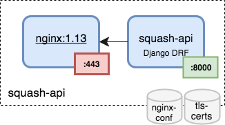

# squash-api
SQuaSH API microservice



## Requirements

`squash-api` microservice requires at least the [squash-db](https://github.com/lsst-sqre/squash-api) microservice and the TLS secrets that are installed by the
[`squash-deployment`](https://github.com/lsst-sqre/squash-deployment) tool.

## Kubernetes deployment

You can provision a Kubernetes cluster in GKE, clone this repo and deploy the `squash-api` microservice using:

```
TAG=latest make deployment
```

### Debugging

Use the `kubectl logs` command to view the logs of the `nginx` and `api` containers:

``` 
kubectl logs deployment/squash-api nginx
kubectl logs deployment/squash-api api
```

Use the `kubectl exec` to run an interactive shell inside a container. Use tab completion or `kubectl get pods` command 
to find the pod's name:


``` 
kubectl exec <TAB> --stdin --tty -c api /bin/sh
```

### Rolling out updates 

Check the update history with:

```
kubectl rollout history deployment squash-api
```

Modify the `squash-api` image and then apply the new configuration for the kubernetes deployment:

```
# we need to setup the env for django to collect static files
virtualenv env -p python3
source env/bin/activate
pip install -r requirements.txt

TAG=latest make build push update
```

Check the deployment changes:
```
kubectl describe deployments squash-api
```

### Scaling up the squash-api microservice

Use the `kubectl get replicasets` command to view the current set of replicas, and then the `kubectl scale` command 
to scale up the `squash-api` deployment:

``` 
kubectl scale deployments squash-api --replicas=3
```

or change the `kubernetes/deployment.yaml` configuration file and apply the new configuration:

```
kubectl apply -f kubernetes/deployment.yaml
```

Check the deployment changes:

``` 
kubectl describe deployments squash-api
kubectl get pods
kubectl get replicasets
```

## Development workflow 

You can install the dependencies and set up a local database with test data for developing

1. Install the software dependencies
```
git clone  https://github.com/lsst-sqre/squash-api.git

cd squash-api

virtualenv env -p python3
source env/bin/activate
pip install -r requirements.txt
```

2. Development database
 
You can use the `squash-db` deployment for local testing, or install `MariaDB 10.1+` microservice, for instance, 
using `brew`:

```
brew install mariadb
mysql.server start
```

Create and initialize the development database

```
mysql -u root -e "DROP DATABASE qadb"
mysql -u root -e "CREATE DATABASE qadb"

cd squash
python manage.py makemigrations
python manage.py migrate
```   

Load some test data
```
python manage.py loaddata test_data
```

3. Run the `squash-api` 

```
export SQUASH_API_DEBUG=True
python manage.py runserver
```

The `squash-api` will run at `http://localhost:8000`. 

### The Django debug toolbar

When you run the `squash-api` with 

```
export SQUASH_API_DEBUG=True
python manage.py runserver
```

you also activate the Django debug toolbar. The Django debug toolbar can be used, among other things, to debug the SQL queries that
are executed when accessing the API.

### The SQuaSH API admin interface

In development mode access the SQuaSH API admin interface at `http://localhost:8000/admin`. 
You need to create a superuser in order to login:
 
```
python manage.py createsuperuser 
```
 

